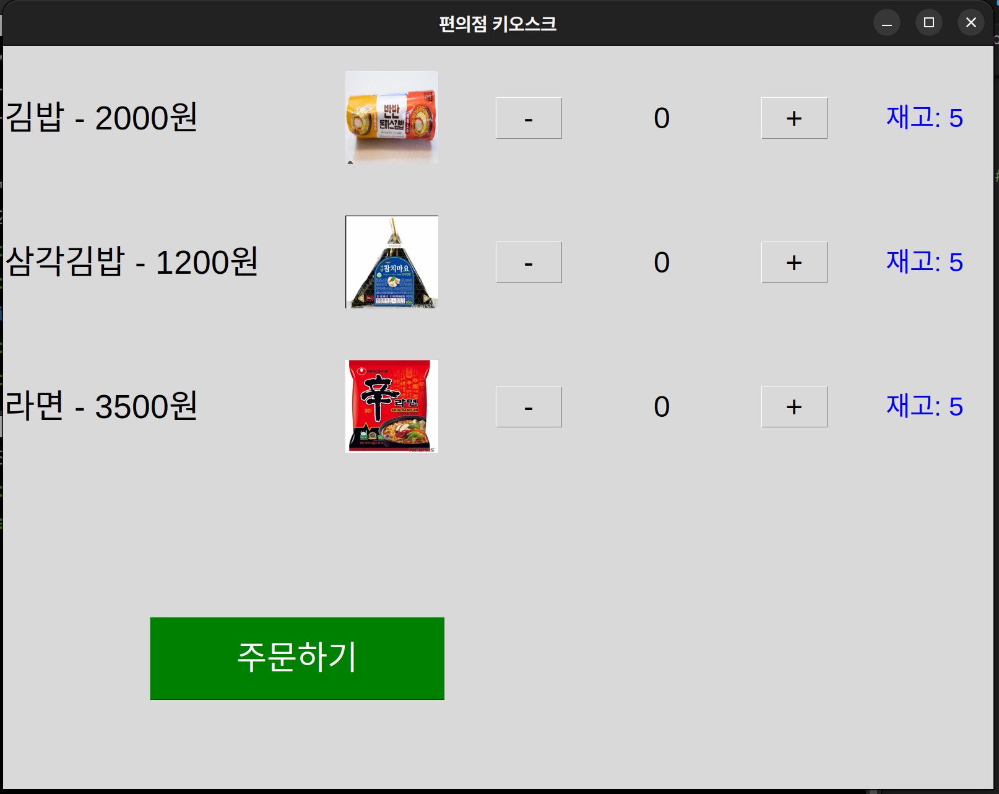

# Convenience-store-chef

본 프로젝트는 Doosan BootCamp 협동-1의 파이널 프로젝트로, **Doosan Robot M0609**를 활용한 **편의점 조리 로봇** 시스템입니다.

<br>


## ▶️ 전체 시나리오 흐름

1. 사용자가 키오스크에서 음식 주문


2. **작업관리자(TaskManager)** 가 조리 작업 생성
3. 로봇이 **전자레인지 및 라면 조리기**를 조작하여 자동 조리 수행 


4. **서빙 위치**로 이동한 후, **사용자 터치 감지** 시 음식 전달
5. **TTS 음성 안내**를 통한 작업 상황 알림


- 티칭 좌표는 JSON 형태로 관리
- 전체 과정은 자동화된 FSM 기반의 노드로 관리

<br>

## 🛠 개발 환경

- **OS & Middleware**: Ubuntu 20.04, ROS 2 Humble  
- **Robot**: Doosan m0609  
- **API**: Doosan Robot Controller SDK
- **etc**: Python 3.8, RViz2  

<br>

## 🧩 설치 및 실행 방법
#### 프로젝트 설치 
```
    $ git clone https://github.com/afleejw/Convenience-store-chef.git
    $ cd Convenience-store-chef
```

#### 실행 순서
1. 로봇과 pc 랜선 연견
2. ROS 노드 실행
```
    # Terminal 1
    $ ros2 launch dsr_bringup2 dsr_bringup2_rviz.launch.py mod=real host=192.168.1.100 port:=12345 model:=m0609

    # Terminal 2
    $ ros2 run kiosk kiosk

    # Terminal 3
    $ ros2 run controller tm
```
3. kiosk gui로 주문할 음식 선택

   
<br>

## 🧱 프로젝트 아키텍처


<br>

## 📌 참고 자료
- **Doosan Robotics 공식 문서**  
  📄 *Doosan_Robotics_Programming_Manual_V2.10.3_v2.10_KR.pdf*  
  🔗 [다운로드 페이지 링크](https://robotlab.doosanrobotics.com/ko/board/Resources/Manual)
- **ROS 공식 문서**  
  🔗 [https://wiki.ros.org](https://wiki.ros.org)
